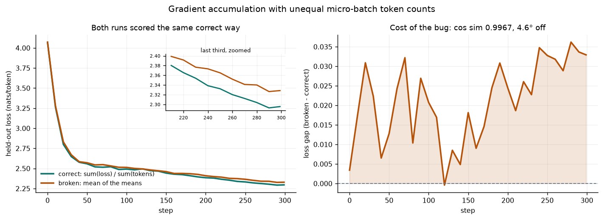
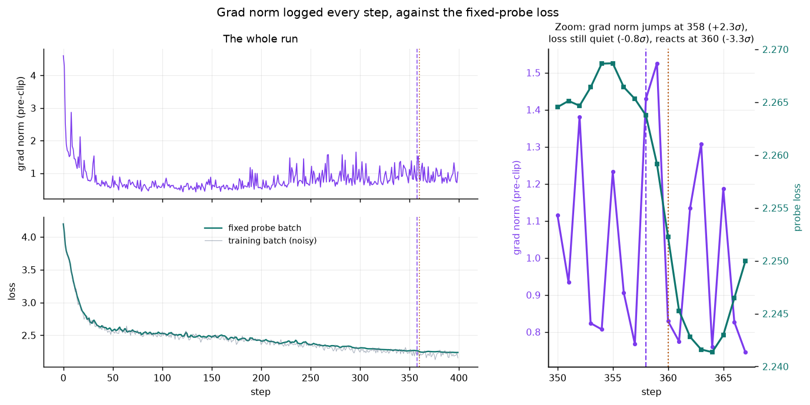
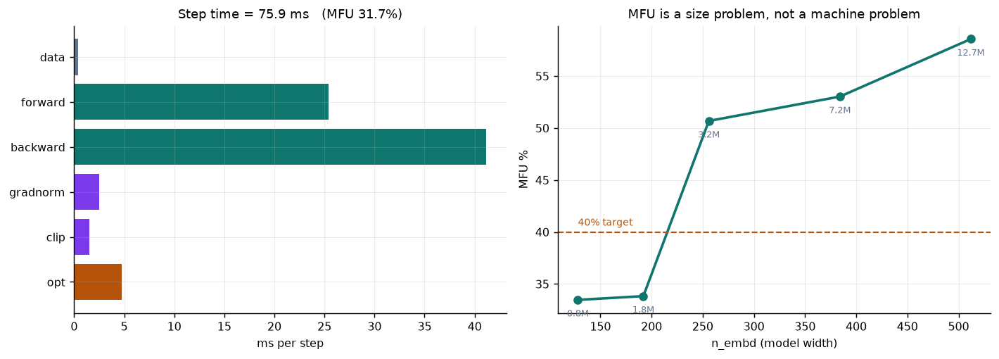
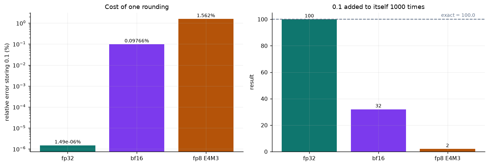

# Making a training loop tell the truth about itself

**ERA V5 — Session 10**

A small GPT and a real training loop, interrogated six ways. Nothing here is quoted from
a paper and nothing is typed in by hand — every number is produced by the code in this
repo and regenerated by `python run_all.py`.

**Where the numbers come from.** §1, §2, §6 and the gradient half of §3 are
hardware-independent by construction — shapes, a float64 gradient identity, the
accumulation algebra and bit patterns come out the same anywhere, and the two claims that
assert a bit-exact identity are pinned to the CPU so they stay falsifiable. The parts that
*train* — §3's 300-step curve and all of §4 — could have drifted between devices. They did
not: §3's final gap came out at **+0.0329 nats/token** on both, and §4's five seeds gave
**identical per-seed event counts** (2/2, 5/1, 5/3, 3/3, 3/1 → 18:10) on a 4-core Xeon and
on a Tesla T4, while step time went 76 ms → 15.6 ms. That is not luck: batches are drawn from a CPU generator and
moved to the device afterwards, so a seed sees the same data everywhere, and fp32 drift
over 250 stable steps never crosses the detector's thresholds. Evidence, not a guarantee —
a longer or less stable run could diverge.

**§5 is different, and deliberately so.** MFU is a statement about a specific device, so
it is reported against that device's own *measured* ceilings and names the machine every
time it quotes a number. The same model scores 31.7% on the Xeon and 15.1% on the T4, and
neither number is wrong — they have different denominators. §5 shows both.

## The answers, at a glance

| # | question | answer |
|---|---|---|
| 1 | every tensor shape in a step | all four stages traced; 0 grad-shape mismatches; AdamW state = 2x the 818,048 params |
| 2 | verify one gradient by hand | central difference vs `backward()` agree to **8.0 decimal digits** (best 8.8); `torch.autograd.gradcheck` passes |
| 3 | break gradient accumulation | mean-of-means rotates the gradient by **4.63°** (cos 0.9967) and costs **+0.0329 nats/token** after 300 steps |
| 4 | grad norm moving before the loss | one clear example (step 358, 2.3σ, loss reacts 2 steps later) - but symmetry test 18:10, **p=0.18, not significant** |
| 5 | MFU, and the distance to 40% | *(CPU reference run)* **31.7%** of the measured ceiling, 27.9% of theoretical. The gap is non-matmul overhead (50% of the step), not kernels or the machine - 40% is crossed by widening the model. On a GPU the dominant term is different and is measured separately: fp32 leaves the tensor cores idle, so the denominator the 40% figures use is several times larger |
| 6 | 0.1 in fp32 / bf16 / fp8 E4M3 | `0x3DCCCCCD` / `0x3DCD` / `0x1D`, all matching hardware; train in **bf16 for matmuls, fp32 for anything that accumulates** |

Two of these did not come out the way I expected, and §4 in particular reports a **negative**
result: the mechanism is sound and one clear example exists, but the statistics do not support
calling the effect systematic in this run.

```
src/model.py         TinyGPT: a plain decoder-only transformer, no fused kernels
src/data.py          tinyshakespeare + fixed-length AND variable-length batchers
src/train.py         the real loop, logging loss/grad-norm/step-time every step
src/shapes.py        Q1  every tensor in a step, with its meaning
src/gradcheck.py     Q2  finite differences vs backward()
src/accumulation.py  Q3  the gradient accumulation bug, and its cost
src/gradnorm.py      Q4  grad norm as a leading indicator
src/mfu.py           Q5  FLOP accounting, device peak, and where the time goes
src/floats.py        Q6  0.1 in three formats, derived exactly and checked against silicon
run_all.py           regenerates every number and figure into artifacts/
notebook.ipynb       the whole thing, top to bottom
```

## Setup

**On Colab** — open `notebook.ipynb`, set **Runtime → Change runtime type → GPU**,
then Run all. The first cell clones this repo and picks the device itself; no other
setup. Without a GPU attached it still runs correctly, on the CPU, and §5 says so.

[](https://colab.research.google.com/github/abinesh1/ERAV5-S10/blob/main/notebook.ipynb)

**Locally**

```bash
pip install -r requirements.txt
python run_all.py                 # writes artifacts/; --quick for a fast pass
python run_all.py --device cpu    # or force a device
jupyter notebook notebook.ipynb
```

### Which device runs what, and why

| part | device | why |
|---|---|---|
| §1 shapes, §6 floats | CPU | shapes and bit patterns; the device is irrelevant |
| §2 gradient check | **CPU, float64** | needs ~16 significant digits; the claim is "agrees to 8 decimals" |
| §3 the control | **CPU** | asserts the two reductions are **bit-for-bit** identical |
| §3 training, §4 training, §5 all | accelerator | real work, no bit-exact claim attached |

§2 and the §3 control are pinned to the CPU **on purpose**. Both assert an exact
identity, and a GPU is free to reorder a reduction without anything being wrong —
pinning them keeps those two claims falsifiable instead of flaky. Everything that
is merely *training* runs wherever the hardware is.

## The model under test

A character-level GPT on tinyshakespeare. Small enough to run a full float64 gradient
check on a laptop CPU, real enough to have all the parts that matter: causal attention,
weight tying, pre-norm residual blocks, AdamW, warmup + cosine decay, gradient clipping.

| | |
|---|---|
| corpus | tinyshakespeare, 1,115,394 chars, vocab 65 |
| layers / heads / width | 4 / 4 / 128 |
| context | 128 tokens |
| parameters | 818,048 (`wte` tied to `lm_head`) |

Two design choices exist purely to make the questions answerable:

1. **No fused attention, no `torch.compile`.** You cannot trace what you cannot see.
2. **A variable-length batcher alongside the fixed-length one.** The gradient accumulation
   bug in §3 is invisible with equal-length micro-batches — it *needs* uneven token counts,
   so the repo can produce them on demand.

---
## 1. Every tensor shape in one training step

A step is not just the forward pass. It is **forward → loss → backward → optimizer update**,
and all four stages hold tensors whose shapes are worth knowing, so `src/shapes.py` walks
all four. Full output: [`artifacts/01_shapes.txt`](artifacts/01_shapes.txt).

The axis letters, once:

| letter | is | meaning |
|---|---|---|
| **B** | batch | independent sequences processed together |
| **T** | time / position | token slots within each sequence |
| **C** | channels | width of the residual stream (`n_embd`) |
| **H** | heads | attention heads per block |
| **D** | head width | `C / H` |
| **V** | vocab | distinct characters in the corpus |
| **L** | layers | transformer blocks |

### Forward activations (B=4, T=16, C=128, H=4, D=32, V=65)

| tensor | shape | what the dimensions mean |
|---|---|---|
| `input.idx` | `(4, 16)` | B, T — each entry is a token id in `[0, V)` |
| `embed.tok` | `(4, 16, 128)` | B, T, C — **what** the token is |
| `embed.pos` | `(16, 128)` | T, C — **where** the token is; broadcast over B |
| `embed.sum` | `(4, 16, 128)` | B, T, C — the residual stream at layer 0 |
| `attn.qkv` | `(4, 16, 384)` | B, T, 3C — q, k and v packed side by side, one matmul makes all three |
| `attn.q` | `(4, 4, 16, 32)` | B, H, T, D — head axis moved next to batch so each head is an independent `T×D` matrix |
| `attn.k` | `(4, 4, 16, 32)` | B, H, T (key positions), D |
| `attn.v` | `(4, 4, 16, 32)` | B, H, T (value positions), D |
| `attn.scores` | `(4, 4, 16, 16)` | B, H, T (query), T (key) — **row i is what token i attends to** |
| `attn.out_heads` | `(4, 16, 128)` | B, T, C — heads re-merged back into the residual width |
| `mlp.hidden` | `(4, 16, 512)` | B, T, 4C — widened feature space, each position independent |
| `logits` | `(4, 16, 65)` | B, T, V — `logits[b,t,:]` scores the token that **follows** position t |
| `loss.flat_logits` | `(64, 65)` | B*T, V — every position flattened into one batch |
| `loss` | `scalar` | cross-entropy, in nats per token |

The one shape worth staring at is `attn.scores`, `(B, H, T, T)`. It is the only tensor that
grows **quadratically** in sequence length, and it is why long context is expensive. In the
training configuration (B=16, H=4) it holds 16·4·128·128 = **1.05M floats at T=128**, and would
hold **268M at T=2048** — a 256× increase for a 16× longer context. Flash-attention exists to
avoid ever materialising this tensor.

### The other three stages

- **Parameters.** `wte.weight` is `(65, 128)` and `lm_head.weight` is `(65, 128)` — the same
  storage, tied. Total 818,048, counted once.
- **Gradients.** Every `p.grad` has *exactly* `p`'s shape — one partial derivative per scalar
  knob. `src/shapes.py` asserts this and reports **0 mismatches**.
- **Optimizer state.** AdamW keeps `exp_avg` (m) and `exp_avg_sq` (v) per parameter, each
  shaped like the parameter: **1,636,096 elements = 2 × 818,048**. That is the whole reason
  Adam costs 3× the memory of the weights alone.

---

## 2. Verify one gradient by hand

`backward()` claims a value for ∂L/∂w. That claim is checkable without trusting autograd
at all — move `w` a hair and watch the loss:

$$\frac{\partial L}{\partial w} \;\approx\; \frac{L(w+h) - L(w-h)}{2h}$$

The **central** difference is used rather than the forward difference because its truncation
error is O(h²) instead of O(h) — several extra digits for free.

Two things have to be right or the digits never appear:

1. **float64.** A float32 loss carries ~7 significant digits, and `L(w+h) − L(w−h)` cancels
   almost all of them away. Asking a float32 loss to agree "to several decimals" is asking
   for something it does not have.
2. **A deterministic loss.** Dropout is 0 and the batch is fixed, so L is a genuine function
   of `w` alone.


Checking `blocks.0.mlp.c_fc.weight[214, 46]` — deliberately the weight with the **largest
|gradient|** in the batch, because agreement on a weight whose gradient is ~0 would prove
nothing about relative error:

```
weight under test : blocks.0.mlp.c_fc.weight[214, 46]   (shape (256, 64), torch.float64)
  w                          = -0.00331202941015363
  h (nudge)                  = 1.0e-06
  L(w)                       = 4.19472072983938382
  L(w+h)                     = 4.19472074704349662
  L(w-h)                     = 4.19472071263527546
  L(w+h) - L(w-h)            = +3.441e-08

  numeric  [L(w+h)-L(w-h)]/2h = +0.01720411058059312
  analytic backward() says    = +0.01720411042204470
  absolute difference         = 1.585e-10
  relative difference         = 9.216e-09
  => they agree to 8.0 decimal digits

  (forward difference only, for contrast: +0.017204112801, rel err 1.383e-07)
```

**They agree to 8.0 decimal digits.** Note the contrast on the last line: the
forward difference, at the same `h`, is ~15× worse.

### The step-size sweep — the part that makes it evidence

One step size proves nothing on its own; `h` could have been lucky. Sweeping it exposes the
classic error valley, and the shape of that valley is the real check:

```
         h                 numeric    rel error  digits  regime
----------  ----------------------  -----------  ------  --------------------------
     1e-01      +0.017062559245065     8.23e-03     2.1  truncation error dominates
     1e-02      +0.017202673155170     8.35e-05     4.1  truncation error dominates
     1e-03      +0.017204096048218     8.35e-07     6.1  truncation error dominates
     1e-04      +0.017204110283053     8.08e-09     8.1  truncation error dominates
     1e-05      +0.017204110447366     1.47e-09     8.8  <-- best
     1e-06      +0.017204110580593     9.22e-09     8.0  round-off error dominates
     1e-07      +0.017204109248325     6.82e-08     7.2  round-off error dominates
     1e-08      +0.017204149216354     2.25e-06     5.6  round-off error dominates
     1e-09      +0.017204015989591     5.49e-06     5.3  round-off error dominates
     1e-10      +0.017208456881690     2.53e-04     3.6  round-off error dominates
     1e-11      +0.017230661342182     1.54e-03     2.8  round-off error dominates
     1e-12      +0.016875389974302     1.91e-02     1.7  round-off error dominates
```

Read the top half of that table: **the relative error falls by exactly 100× for every 10×
reduction in `h`.** That factor of 100 is the O(h²) truncation law of the central difference,
measured rather than asserted — a forward difference would fall by only 10× per decade.

Then it turns around. Below the optimum, `L(w+h)` and `L(w−h)` agree in so many leading digits
that the subtraction throws away precision faster than the truncation error shrinks — classic
catastrophic cancellation, growing as 1/h. The best `h` sits where the two curves cross.

### Independent corroboration

`torch.autograd.gradcheck` run over **all 16 parameter tensors** of a small
configuration — the same idea done exhaustively rather than for one hand-picked weight:
**PASS**.


---

## 3. Break gradient accumulation on purpose

### The bug

You want the gradient of the mean loss over a big batch, but the big batch does not fit,
so you split it into N micro-batches and accumulate. The tempting line is:

```python
for mb in micro_batches:
    loss = model(mb).mean()   # mean over the tokens IN THIS micro-batch
    (loss / N).backward()     # "average of the averages"
```

This is correct **if and only if every micro-batch holds the same number of tokens.**
Write out the weight each individual token ends up with:

| reduction | weight of token *i* sitting in micro-batch *m* |
|---|---|
| correct | `1 / Σ_m n_m` — identical for every token |
| mean-of-means | `1 / (N · n_m)` — depends on which micro-batch it landed in |

So a token in a short micro-batch counts `Σ_m n_m / (N · n_m)` times as much as it should.
**Short micro-batches shout; long ones get muffled.**

With fixed-length language-model batches you never notice, because every micro-batch has
exactly `B × T` tokens and the two formulas coincide. With variable-length sequences —
which is to say, with real data — they do not.

### The fix

Reduce with `sum` rather than `mean`, and divide once by the token count of the *whole*
batch, which you count up front:

```python
total_tokens = sum(mb.n_real_tokens for mb in micro_batches)   # count first
for mb in micro_batches:
    loss_sum = model(mb).sum()        # SUM over this micro-batch's real tokens
    (loss_sum / total_tokens).backward()   # one denominator for the whole batch
```

Now every token carries weight `1 / total_tokens` no matter which micro-batch it happened to
land in, which is exactly what the un-split big batch would have done. The cost is one extra
pass to count tokens, or carrying the count alongside the batch — which `src/data.py` does.

### Measured on real variable-length batches

| micro-batch | real tokens | share of batch | weight each of its tokens gets vs correct |
|---|---|---|---|
| 0 | 283 | 12.7% | **1.967×** |
| 1 | 401 | 18.0% | **1.388×** |
| 2 | 714 | 32.1% | **0.780×** |
| 3 | 829 | 37.2% | **0.672×** |

The micro-batches differ by **2.93×** in token count, so the
per-token weighting is wrong by that same spread: tokens in micro-batch 0 count
**1.97× too much**, tokens in micro-batch 3 count
**0.67× too little**.

### What that does to the gradient

Measured at *identical weights*, on *identical data* — only the reduction differs:

| | |
|---|---|
| cosine similarity | **0.996735** |
| angle between the gradients | **4.63°** |
| relative L2 error | **8.11%** |
| norm ratio | 1.0047 |

The norm ratio is essentially 1 and the cosine is not, and that combination is the whole point.
The bug is **not** a rescale — which Adam would absorb — it is a **4.63° rotation**
of the gradient, and no amount of adaptive step sizing rotates it back.

### The control

If the claim is "this needs unequal lengths", equal lengths must make the two identical:

```
CONTROL - all micro-batches exactly 512 tokens:
  cosine similarity      : 1.0000000000
  max |elementwise diff| : 0.000e+00  (0.0 = bit-for-bit identical)
  => identical, as the algebra requires. The bug needs unequal lengths.


TRAINING BOTH REDUCTIONS
step    0 | val(correct) 4.0690 | val(mean-of-means) 4.0724 | gap +0.0034
step   50 | val(correct) 2.5579 | val(mean-of-means) 2.5706 | gap +0.0128
step  100 | val(correct) 2.4922 | val(mean-of-means) 2.5130 | gap +0.0207
step  150 | val(correct) 2.4423 | val(mean-of-means) 2.4605 | gap +0.0181
step  200 | val(correct) 2.3846 | val(mean-of-means) 2.4091 | gap +0.0245
step  250 | val(correct) 2.3323 | val(mean-of-means) 2.3651 | gap +0.0328
step  299 | val(correct) 2.2956 | val(mean-of-means) 2.3285 | gap +0.0329
```

Not "close" — the same bits. The bug is entirely a property of uneven token counts, which is
why fixed-length LM training never shows it.

### Both curves together



Two identical models: same initialisation, same seed, same micro-batches at every step. The
*only* difference is how the micro-batch losses are combined. Both are scored with the **same
correct** token-weighted held-out loss, so this is apples-to-apples.

After 300 steps: **2.2956** (correct) vs **2.3285**
(mean-of-means) — a gap of **+0.0329 nats/token**, and the right-hand panel shows
it widening rather than washing out.


---

## 4. Grad norm every step, and a step where it moved first

### Why it should lead at all

The loss at step *t* is a property of the weights **before** step *t*'s update. The grad
norm at step *t* is the slope at those same weights, and it is what sizes the update that
produces the weights measured at step *t+1*:

```
grad norm at t  ->  size of update at t  ->  loss at t+1
```

The gradient is a derivative and the loss is a level. A derivative moves first, almost by
construction. The job is to catch it happening in a real run without fooling yourself.

### Two things that would have faked the result

**Non-causal baselines.** To say "the grad norm *jumped*" you need a baseline for normal.
If that baseline is a centred window, it contains the future, and the future is exactly
what you are claiming to predict. Every baseline in `src/gradnorm.py` is an EMA of
strictly past values — `causal_z` never looks at index ≥ t.

**A noisy loss.** The per-step training loss is computed on a *different random batch each
step*, so most of its step-to-step wobble is batch difficulty, not model change. That noise
swamps any lead. So the loop also evaluates a **fixed probe batch** every step, at the same
weights, so that a change in it can only have come from the weights. The plot below shows
both: the grey line is the noisy training loss, the teal line is the probe.

### The example



Over 400 logged steps the detector found **3 candidate lead steps** —
places where the grad norm was a surprise, the loss was not, and the loss then became one:

```
step 358: the gradient moved, the loss did not.

  step   grad norm      d(gn)    z(gn)       loss    d(loss)   z(loss)
--------------------------------------------------------------------------
   355      1.2320    +0.4251    +1.19     2.2687    +0.0000     +0.60
   356      0.9055    -0.3265    -0.51     2.2664    -0.0023     -0.04
   357      0.7677    -0.1378    -1.14     2.2653    -0.0011     -0.35
   358      1.4292    +0.6615    +2.27     2.2638    -0.0016     -0.79  <-- grad norm jumps here
   359      1.5253    +0.0961    +1.95     2.2592    -0.0046     -2.14
   360      0.8291    -0.6962    -0.96     2.2523    -0.0069     -3.31  <-- loss reacts here
   361      0.7745    -0.0546    -1.02     2.2453    -0.0070     -3.10
   362      1.1350    +0.3605    +0.40     2.2428    -0.0025     -2.13

grad norm at step 358: 1.4292  (z = +2.27, a 2.3-sigma surprise against its own past)
loss      at step 358: 2.2638  (z = -0.79, well inside the noise - nothing visible had happened yet)
loss      at step 360: 2.2523  (z = -3.31, moving -0.0069 in one step)

lag from gradient signal to loss response: 2 step(s).
```

Full per-step log and all three tests: [`artifacts/04_gradnorm.txt`](artifacts/04_gradnorm.txt).

### Reading the result honestly

Three tests, in increasing order of how hard they are to fool. They do not all agree, and
the disagreement is the interesting part.

**1. The anecdote** — one step where the gradient moved and the loss did not. This is what
was asked for, and it is real. But a single step out of 400 could be luck.

**2. The lagged cross-correlation** over the whole run. If the grad norm systematically led
the loss, correlation would peak at a positive lag. **It does not** — the correlation is
within noise at every lag, positive and negative alike.

**3. The symmetry test**, which is the one designed to settle the question either way. Run the identical
detector in both directions with identical thresholds:

- *forward*: grad norm surprises at t, loss is quiet at t, loss moves by t+3
- *reverse*: loss surprises at t, grad norm is quiet at t, grad norm moves by t+3

Because both directions use the same detector, any imbalance between the counts is a
property of the training dynamics rather than of the test.


corr(|z grad norm at *t*|, |z loss at *t+lag*|), over the whole run:

| lag | correlation |
|---|---|
| -6 | -0.0625 |
| -5 | -0.0383 |
| -4 | +0.0149 |
| -3 | +0.0340 |
| -2 | +0.0900 |
| -1 | +0.1119 |
| +0 | +0.0481 |
| +1 | +0.0808 |
| +2 | -0.0214 |
| +3 | -0.0721 |
| +4 | -0.0813 |
| +5 | -0.0264 |
| +6 | +0.1306 |

Every value is within noise. If the grad norm systematically led the loss, this would peak at
a positive lag. It does not.

| seed | grad-norm-leads | loss-leads |
|---|---|---|
| 1337 | 2 | 2 |
| 7 | 5 | 1 |
| 21 | 5 | 3 |
| 99 | 3 | 3 |
| 2024 | 3 | 1 |
| **total** | **18** | **10** |

**Read that carefully before believing it.** 18 vs 10 looks like a result, and a ratio with no
p-value attached is exactly how you end up believing noise. The exact two-sided binomial test
against a 50/50 null gives **p = 0.185** — *not* significant at the 5% level.

### The honest conclusion

- The **anecdote is real**: step 358 genuinely shows the grad norm moving
  2.3σ while the loss sat inside the noise, with the loss reacting 2 steps
  later. That is what was asked for, and it is in the log.
- The **mechanism is real**: the loss at step *t* cannot reflect the update made at step *t*,
  so a lead of at least one step is forced by the ordering of operations, not by any empirical
  claim.
- But **this run does not establish that the lead is systematic**. The lagged correlation is
  within noise at every lag, and the symmetry test leans the right way without reaching
  significance. Getting more events (longer runs, more seeds) is the obvious next step; I am
  not going to report a 1.8× ratio from 28 events as if it settled the question.

The interesting part is *why* the effect is so hard to see in a healthy run: **when training is
going well, nothing surprising happens.** The grad norm is a leading indicator of *trouble* —
loss spikes, divergence, a bad batch, a learning rate past the stable range — and a stable run
has almost none of that to lead. A detector looking for surprises in a run with no surprises in
it is going to be starved of evidence, which is exactly what the counts above show.

### The instability run

Same detector, on a run with the learning rate pushed past the stable range and clipping
switched off, to see whether a genuinely unstable run offers more to find:

```
INSTABILITY RUN
step 142: the gradient moved, the loss did not.

  step   grad norm      d(gn)    z(gn)       loss    d(loss)   z(loss)
--------------------------------------------------------------------------
   139      0.2257    -0.0455    -1.42     2.8886    +0.0029     -0.59
   140      0.2464    +0.0207    -0.56     2.8991    +0.0105     +0.56
   141      0.2581    +0.0118    -0.16     2.9034    +0.0043     +0.98
   142      0.3254    +0.0673    +2.04     2.8978    -0.0056     +0.22  <-- grad norm jumps here
   143      0.3381    +0.0126    +1.82     2.8851    -0.0127     -1.33
   144      0.2298    -0.1083    -1.27     2.8764    -0.0087     -2.11  <-- loss reacts here
   145      0.3563    +0.1265    +1.95     2.8732    -0.0031     -1.81
   146      0.2417    -0.1145    -0.92     2.8701    -0.0031     -1.64

grad norm at step 142: 0.3254  (z = +2.04, a 2.0-sigma surprise against its own past)
loss      at step 142: 2.8978  (z = +0.22, well inside the noise - nothing visible had happened yet)
loss      at step 144: 2.8764  (z = -2.11, moving -0.0087 in one step)

lag from gradient signal to loss response: 2 step(s).
```


Worth noting what this *does not* show. The huge spike in such a run is in the first few steps,
and it is so large that it inflates the EMA variance for everything after it — so the detector,
which measures surprise relative to recent history, then finds only comparable-sized events to
the stable run's. The mechanism is the same one; turning the learning rate up did not hand me a
cleaner example, and I am not going to present it as though it had.

---

## 5. MFU, honestly

$$\text{MFU} = \frac{\text{model FLOPs required per second}}{\text{peak FLOPs the device can do}}$$

"Model FLOPs" means the arithmetic **the maths demands**, not the arithmetic the hardware
happened to execute. Recomputation, padding waste and masked-away attention all cost real
time and earn no credit. That is the point — MFU is supposed to punish them.

### FLOPs per token, derived

Forward pass, two contributions:

**(a) Weight matmuls.** Every parameter sitting in a matmul is touched once per token as a
multiply-accumulate — 2 FLOPs.

```
per block:  c_attn 3C²  +  attn c_proj C²  +  mlp c_fc 4C²  +  mlp c_proj 4C²  =  12C²
plus the tied lm_head:  V·C
                                        N_mm = L·12C² + V·C
```

**(b) Attention score/value matmuls.** These involve **no parameters**, and they grow with
sequence length — this is the term people forget:

```
QK^T   per token:  2·T·D per head × H heads  =  2·T·C
att@V  per token:  2·T·C
                          per layer: 4·T·C     over L layers: 4·L·T·C
```

Backward costs 2× forward (one matmul for the input gradient, one for the weight gradient):

$$\boxed{\text{FLOPs/token} = 6\,N_{mm} + 12\,L\,T\,C}$$

Embedding and position lookups are **gathers, not matmuls** — ~0 FLOPs. LayerNorm, GELU,
softmax and the residual adds are elementwise: real time, but a rounding error in FLOPs, and
excluded by convention. Excluding them makes MFU a *lower* bound on efficiency, which is the
conservative direction, so it is the right convention to keep.

> **On the common `6N` shorthand.** That uses N = *all* parameters. Here `N_mm` counts only
> the parameters that actually sit in a matmul. The difference for this model is
> 818,048 − 794,752 = 23,296 params (`wpe`, every bias, every LayerNorm gain), which
> contribute essentially nothing to the FLOP count but would inflate it by 2.9% if counted.
>
> **On the causal mask.** Half of the `T × T` attention scores are masked away, so *in
> principle* only half the attention FLOPs are needed. This implementation computes the full
> square and then masks — so counting the dense `4·L·T·C` is the honest number *for this code*.
> A flash-attention kernel that skips the masked half would do roughly half this work, and
> then the same formula would **over**count its model FLOPs and flatter its MFU. Which
> convention you use is a real choice, and it should be stated rather than assumed.

### The machine, and the ceilings

The numerator of MFU is settled by the algebra above. **The denominator is the arguable
half, and it is where most quoted MFU numbers quietly cheat.** So every denominator that
could be defended gets reported:

| denominator | what it is | how much to trust it |
|---|---|---|
| datasheet peak | vendor number for the part | optimistic by construction; never reached by anything |
| **measured fp32 GEMM ceiling** | best a large square fp32 matmul actually sustains here | **the one worth acting on** — nothing in this process beats a big GEMM |
| measured tensor-core ceiling | same, in bf16/fp16 on the tensor cores | only reachable by code that uses them; this model does not |

These differ by **more than an order of magnitude** on a modern GPU. An MFU number
without its denominator attached is not a measurement, it is a mood — so `compute_mfu`
prints all of them and labels which is which.

> **Why this matters for the 40% target.** Published "40% MFU" figures are almost always
> quoted against the **bf16 tensor-core** peak, by code that is actually running bf16
> matmuls with fused kernels. This model trains in **fp32**, so it runs on the CUDA cores
> and cannot touch the tensor cores at all. Comparing its MFU to 40% without saying that
> is comparing two different fractions. §5(d) puts a measured number on the gap.

#### Reference run — 4-core Xeon, CPU, fp32

The numbers in this section are from a CPU reference run, kept because they are a
complete worked example. **Re-run the notebook on a GPU and every one of them
changes** — the final cell prints the replacements as JSON.

| | |
|---|---|
| CPU | Intel(R) Xeon(R) Processor @ 2.10GHz |
| topology | 4 physical cores @ 2.1 GHz, AVX-512 |
| FLOPs/cycle/core | 16 fp32 lanes × 2 (FMA) × 2 ports = 64 |
| **theoretical fp32 peak** | **537.6 GFLOP/s** |
| **measured SGEMM ceiling** | **472.7 GFLOP/s** (87.9% of theoretical) |

That the measured ceiling lands at 88% of theoretical is itself a check: it says the
64-FLOPs/cycle model of this CPU is right. On a GPU the same check is more interesting,
because a small-model workload typically reaches a far smaller fraction of its datasheet
number — which is the point §5(a) and §5(c) exist to test.

### The result

| | |
|---|---|
| FLOPs per token (fwd+bwd) | 5,554,944 |
| — of which attention (non-parameter) | 14.2% of the forward pass |
| FLOPs per step (B=16, T=128) | 11.3765 GFLOP |
| measured step time | 75.93 ms (26,973 tokens/s) |
| achieved | **149.84 GFLOP/s** |
| **MFU vs theoretical peak** | **27.87%** |
| **MFU vs measured ceiling** | **31.70%** |

### What is costing me the distance to 40%?

Four candidate explanations. I measured all four rather than picking a favourite.

**(a) Are the matmul shapes bad?** A matmul with a small `K` or `N` cannot saturate a vector
unit however good the kernel is, and this is a small model — so this is the obvious suspect.
Benchmarking every matmul shape the forward pass actually issues:

```
matmul                              M     K     N  x   GFLOP/s  % of peak  FLOP share
------------------------------------------------------------------------------------------
c_attn   (B*T,C)x(C,3C)          2048   128   384  4     523.7    110.8%      21.2%
attn QK^T per head               8192    32   128  4     446.0     94.3%       7.1%
attn AV   per head               8192   128    32  4     452.7     95.8%       7.1%
attn c_proj (B*T,C)x(C,C)        2048   128   128  4     497.8    105.3%       7.1%
mlp c_fc  (B*T,C)x(C,4C)         2048   128   512  4     500.1    105.8%      28.3%
mlp c_proj (B*T,4C)x(4C,C)       2048   512   128  4     301.1     63.7%      28.3%
lm_head  (B*T,C)x(C,V)           2048   128    65  1     336.1     71.1%       0.9%

FLOP-weighted matmul throughput: 417.3 GFLOP/s = 88.3% of peak
  (so matmul SHAPE is not the problem here)
```

**Verdict: not guilty.** The FLOP-weighted throughput of these shapes is **88.3%** of peak
— the slowest in this run were `mlp c_proj` (64% of peak, N=128) and `lm_head` (71% of peak, N=65), both held back by a narrow output dimension, and the fastest reached 111%. Nothing here is leaving a factor of three on the table for want of a better shape.

Two honest caveats about this benchmark, because both matter for reading (b):

- **Some rows read above 100% of "peak".** That is not an error; it is the measured ceiling
  being the wrong yardstick for these shapes. The ceiling came from a 1024²/2048² SGEMM whose
  operands do not fit in cache, whereas several of these matmuls are small enough to run
  cache-resident and therefore beat it. It is a reminder that "peak" is a property of a
  workload, not just of a chip.
- **These are hot-loop timings.** Each matmul runs repeatedly on the same operands, so its
  caches are warm in a way the real forward pass's never are. This is an **upper** bound on
  in-situ matmul throughput — which is exactly why (b)'s arithmetic below comes out optimistic
  against the measured MFU rather than landing on it.

**(b) How much of the step is matmul at all?** Only `mm`/`addmm`/`bmm` earn model FLOPs.
Softmax, GELU, LayerNorm, the causal `masked_fill`, the transpose copies and the AdamW update
all cost wall clock and earn exactly nothing. Profiling by operator:

```
matmul ops (mm/addmm/bmm) : 49.6% of step time
everything else          : 50.4% of step time

(call counts are TOTALS over the 5 profiled steps, not per-step)

operator                              self %    calls
------------------------------------------------------
aten::mm                              27.8%      175  <- matmul
aten::addmm                           11.6%       80  <- matmul
aten::bmm                             10.1%      120  <- matmul
aten::copy_                            9.7%     1605
aten::gelu_backward                    3.4%       20
aten::masked_fill_                     3.1%       40
Optimizer.step#AdamW.step              2.4%        5
aten::mul                              2.3%       40
aten::sum                              2.3%       90
aten::native_layer_norm_backward       2.0%       45
aten::_softmax                         1.8%       20
aten::gelu                             1.7%       20
aten::add_                             1.4%      560
aten::cat                              1.3%       20
aten::_softmax_backward_data           1.3%       20
aten::mul_                             1.3%      520
aten::native_layer_norm                1.0%       45
aten::add                              0.9%       50
```

**This is the answer.** Only **49.6% of the step is in matmuls**; the other
**50.4% earns no FLOP credit at all.** And the arithmetic closes:

```
MFU / matmul share  =  31.7% / 49.6%  =  63.9%
```

which is what MFU would be if every non-matmul operation were free.

Where that non-matmul half actually goes:

| phase | ms | share of step |
|---|---|---|
| `data` | 0.43 | 0.6% |
| `forward` | 25.41 | 33.5% |
| `backward` | 41.12 | 54.2% |
| `gradnorm` | 2.53 | 3.3% |
| `clip` | 1.52 | 2.0% |
| `opt` | 4.73 | 6.2% |

Two things worth naming in that table:

- **The optimizer step is 6.2% of wall clock for a model this small.** AdamW touches
  `W`, `grad`, `m` and `v` — four reads/writes over every parameter — and does almost no
  arithmetic. It is pure memory bandwidth, and it earns zero model FLOPs.
- **`gradnorm` + `clip` is 5.3% of the step, and that is my own instrumentation.**
  Logging the pre-clip grad norm every step for §4 costs real MFU. Honest accounting means
  admitting that measuring the run slows the run.

**(c) Is it the machine, or the model size?** These two hypotheses make opposite predictions.
If low MFU were something fundamental about this CPU, growing the model would not help. If it
is fixed per-step overhead that does not scale with C², growing the model fixes it. That is
decidable by experiment — batch, sequence length and depth held fixed, width the only variable:

```
n_embd layers   B    T      params  ms/step  GFLOP/s     MFU
---------------------------------------------------------------
   128      4  16  128     818,048     67.0    169.9   33.5%
   192      4  16  128   1,816,896    142.5    170.6   33.8%
   256      4  16  128   3,208,960    167.5    251.2   50.7%
   384      4  16  128   7,172,736    339.0    271.7   53.0%
   512      4  16  128  12,709,376    565.6    285.5   58.6%
```



**40% is crossed between C=192 (33.8%) and C=256 (50.7%), and the curve then plateaus around 59%.** Nothing
about the machine changed. The whole deficit at C=128 was that elementwise work scales with
`C` while matmul work scales with `C²`, so at small width the fixed overhead dominates —
and the plateau lands in the same region as the 63.9% "if overhead were free" figure
predicted from the small model's operator breakdown — close enough to corroborate the
diagnosis, not so close that I would claim the two numbers were measuring the same thing.

**(d) Is it the dtype?** On a GPU this is the first-order term, and it is pure
bookkeeping rather than a kernel problem. The model trains in fp32, so every matmul runs
on the CUDA cores; the tensor cores sit idle. `measured_peak` times a large GEMM in each
dtype the device supports, so the size of that choice is measured rather than asserted:

```
measured GEMM ceilings on this device (what it really reaches):
  fp32   <fp32 ceiling>  TFLOP/s
  tf32   <tf32 ceiling>  TFLOP/s      <- Ampere and later only
  bf16   <bf16 ceiling>  TFLOP/s      <- what the 40% figures are quoted against
```

and `compute_mfu` then divides the *same* achieved throughput by each of them:

| denominator | MFU | what it means |
|---|---|---|
| datasheet fp32 | lowest | vendor optimism, useful only as a sanity check |
| measured fp32 | **the honest one** | how well this code uses the units it actually runs on |
| measured bf16/tensor-core | lowest of all | the denominator the published 40% figures use |

The trap: switching to bf16 raises the numerator *and* the denominator. It is a large
**wall-clock** win and can easily be a *smaller* MFU number. Wall-clock and MFU are
different questions, and reporting a speedup as an efficiency gain is the most common way
MFU gets misquoted. On the CPU reference run this candidate is nearly moot — there is no
matrix engine eager fp32 PyTorch can reach — which is exactly why the notebook measures it
per device instead of hardcoding a conclusion.

### So, honestly

On the CPU reference run, at the configuration actually being trained here —
`n_embd=128`, 818K params, on 4 CPU cores —
**MFU is 31.7% against the measured ceiling and 27.9% against theoretical peak.** The
distance to 40% is *not* bad kernels, *not* the attention term (only 14.2% of forward
FLOPs at T=128), and *not* the machine. It is that **the model is too small to amortise its own
per-step overhead**, and about 5.3% of it is the price of the instrumentation this repo
exists to demonstrate.

**On a GPU the ordering changes, and (d) moves to the top.** A 4-layer 128-wide model
issuing 2048-token matmuls cannot fill an accelerator built for matrices two orders of
magnitude larger, and it is running in the one dtype that leaves the tensor cores idle.
Expect a much smaller MFU there than on the CPU — and that is not the GPU being worse,
it is a much larger denominator being divided into the same small model. The size sweep
in (c) is the experiment that separates those two readings; run it on the GPU and the
curve should climb far more steeply with width than the CPU one does.

Three things would close the gap, in descending order of effect:

1. **Make the model wider.** Demonstrated above — the single biggest lever, and free of any
   cleverness.
2. **Fuse the elementwise work.** `torch.compile` or a fused attention kernel would collapse
   most of the softmax / mask / transpose-copy traffic. The `aten::copy_` line in the profile
   above (call counts there are totals over 5 profiled steps, so divide by 5 for per-step)
   is mostly `.contiguous()` after `.transpose()` — pure memory movement earning no FLOPs.
3. **Use bf16 for the matmuls.** This machine has AMX and AVX-512-bf16 (see the table above),
   neither of which fp32 eager PyTorch can reach. Worth being precise about what that buys,
   though: it would cut wall-clock time substantially, but it would **not** necessarily raise
   *MFU*, because the bf16 peak is several times the fp32 peak — the denominator moves too.
   Wall-clock and MFU are different questions, and conflating them is an easy way to report a
   speedup as an efficiency gain. See §6 for why bf16 is nonetheless the right precision here.

---

## 6. 0.1 in fp32, bf16 and fp8 E4M3

0.1 is not representable in binary, for the same reason 1/3 is not representable in
decimal: `10 = 2 × 5`, and that factor of 5 is not a power of the base. Doing the
long multiplication by hand:

```
0.1 x 2 = 0.2  ->  0
0.2 x 2 = 0.4  ->  0
0.4 x 2 = 0.8  ->  0
0.8 x 2 = 1.6  ->  1   (keep 0.6)
0.6 x 2 = 1.2  ->  1   (keep 0.2)
0.2 ... already seen at line 1, so it cycles from here

0.1 = 0.0 0011 0011 0011 ... = 0.0(0011) repeating
```

Normalising to put a single 1 before the point:

```
0.1 = 1.1001 1001 1001 ... x 2^-4      mantissa fraction = 0.6 = .(1001) repeating
```

So in **all three formats the sign is 0 and the unbiased exponent is −4.** The only thing
that changes between them is how many bits of the repeating tail `.1001 1001 1001…`
survive, and which way the leftovers round. In every case here the first discarded bit is
a 1 with a non-zero tail behind it, so round-to-nearest rounds **up** — all three formats
land slightly *above* 0.1, never below.

### fp32 — 1 sign, 8 exponent, 23 mantissa, bias 127

```
exponent : -4 + 127 = 123 = 01111011
mantissa : take 23 bits of (1001) repeating -> 10011001100110011001100
           next bit is 1 with more behind it -> round up
                                             -> 10011001100110011001101

  0 01111011 10011001100110011001101   =  0x3DCCCCCD
```

### bf16 — 1 sign, 8 exponent, 7 mantissa, bias 127

Same exponent field as fp32 — bf16 *is* fp32 with 16 mantissa bits removed.

```
mantissa : 7 bits -> 1001100, next bit 1 with more behind -> round up -> 1001101

  0 01111011 1001101   =  0x3DCD
```

### fp8 E4M3 — 1 sign, 4 exponent, 3 mantissa, bias 7

```
exponent : -4 + 7 = 3 = 0011
mantissa : 3 bits -> 100, next bit 1 with more behind -> round up -> 101

  0 0011 101   =  0x1D
```

### All three, checked against the silicon

| format | sign / exp / mantissa | derived by hand | hardware says | match | value actually stored | rel. error |
|---|---|---|---|---|---|---|
| fp32 | `0 01111011 10011001100110011001101` | `0x3DCCCCCD` | `0x3DCCCCCD` | ✅ | `13421773/134217728` = 0.10000000149011612 | 1.490e-08 |
| bf16 | `0 01111011 1001101` | `0x3DCD` | `0x3DCD` | ✅ | `205/2048` = 0.10009765625 | 9.766e-04 |
| fp8 E4M3 | `0 0011 101` | `0x1D` | `0x1D` | ✅ | `13/128` = 0.1015625 | 1.562e-02 |

**All 3 hand-derived bit patterns match the hardware exactly.** The
derivations use exact rational arithmetic (`fractions.Fraction`), never floating point — so
the "by hand" answer cannot inherit an error from the very thing it is supposed to be checking,
which would otherwise make the whole verification circular.



### What each format actually buys

| format | bits | e | m | eps (2⁻ᵐ) | ~dec digits | min normal | max normal | range (decades) |
|---|---|---|---|---|---|---|---|---|
| fp32 | 32 | 8 | 23 | 1.192e-07 | ~7.9 | 1.18e-38 | 3.40e+38 | **76.5** |
| bf16 | 16 | 8 | 7 | 7.812e-03 | ~3.1 | 1.18e-38 | 3.39e+38 | **76.5** |
| fp8 E4M3 | 8 | 4 | 3 | 1.250e-01 | ~1.9 | 1.56e-02 | 4.48e+02 | **4.5** |

Read the last two columns together, because they are the whole story. bf16 gives up **16
mantissa bits** relative to fp32 and keeps **exactly the same 76.5 decades of range**. fp8 E4M3
gives up range as well, collapsing to **4.5 decades**.

### Adding 0.1 to itself 1000 times (exact answer: 100.0)

| format | result | relative error |
|---|---|---|
| fp32 | 99.999046 | 0.001% |
| bf16 | 32.000000 | 68.000% |
| fp8 E4M3 | 2.000000 | 98.000% |

### Which would I train in?

**bf16 for the matmuls, fp32 for anything that accumulates.**

The one-off rounding error of a single 0.1 is not what decides this. What decides it is
that error **compounding** — which is exactly what gradient accumulation, weight updates
and optimizer moments do all day. The `accumulation_demo` above is that in miniature, and
its result is the whole argument.

bf16 does not stall at 32 because 0.1 is stored imprecisely. It stalls because of
**swamping**: once the accumulator grows large enough that the addend falls below *half an
ulp* of it, `acc + x` rounds straight back to `acc` and the sum stops moving forever.

The stall values are not arbitrary — they are predicted exactly by the ulp arithmetic:

| | exponent of acc | ulp = 2^(e−m) | half-ulp | is 0.1 above it? | `acc + 0.1` rounds to |
|---|---|---|---|---|---|
| bf16 at acc=16 | 4 | 2⁻³ = 0.125 | 0.0625 | yes | 16.125 — still moving |
| **bf16 at acc=32** | 5 | 2⁻² = 0.25 | **0.125** | **no (0.1 < 0.125)** | **32.0 — dead** |
| fp8 at acc=1.875 | 0 | 2⁻³ = 0.125 | 0.0625 | yes | 2.0 — still moving |
| **fp8 at acc=2** | 1 | 2⁻² = 0.25 | **0.125** | **no** | **2.0 — dead** |

Both formats die at the exact value where their ulp doubles past 0.2. This is the failure
mode that matters in training, and it is why the master copy of anything you accumulate into
lives in fp32 regardless of what the matmuls run in.

Taking the three in turn:

- **Not fp32 everywhere.** It is the safe choice and roughly half the throughput. On any
  machine with bf16 tensor cores you are spending most of your FLOPs on precision the
  gradients demonstrably do not need.

- **bf16 over fp16 — and this is the entire reason bf16 exists.** Both are 16 bits. fp16
  splits them 5 exponent / 10 mantissa; bf16 splits them 8 / 7. bf16 keeps *all* of fp32's
  exponent bits, so it has the **same dynamic range as fp32** — 76.5 decades in the table
  above, versus about 12 for fp16 — and pays for it in mantissa. That trade is the right way
  round for training, because **gradients underflow long before they lose meaningful
  precision**. Range is the scarce resource, not precision. It is also why bf16 needs no
  loss scaling and fp16 does: fp16's floor at ~6e-5 is inside the range where real gradients
  live, so fp16 training has to multiply the loss up to keep them off the floor. bf16 simply
  does not have the problem.

- **Not fp8 E4M3 for the whole loop.** 4.5 decades of range and ~1.9 decimal digits is
  genuinely enough for a *forward matmul with per-tensor scaling*, which is exactly how it
  is used in production — the scale factor moves the tensor into the narrow window where
  E4M3 has resolution, the matmul happens in 8 bits, and the result accumulates in higher
  precision. What you must not do is keep master weights, optimizer moments, or the
  accumulation itself in fp8. The 1000-add experiment is what happens if you forget: the
  answer comes out 2 instead of 100.

  (Note also that E4M3 has no infinities — the all-ones exponent is spent on NaN — which is
  why the paired format E5M2, with more range and less precision, is the one usually used
  for gradients in the backward pass.)

**The rule underneath all of it:** exponent bits buy range, mantissa bits buy precision, and
training runs out of range long before it runs out of precision. Every format decision above
falls out of that one sentence.

---

## What the six questions have in common

Each one is a place where the convenient answer and the true answer differ, and where the
difference is invisible unless you go and measure:

| | the convenient answer | what measuring says |
|---|---|---|
| 1 | "the shapes are `(B, T, C)`" | a step also has gradients and *two* optimizer moments per parameter — Adam's memory is 3× the weights |
| 2 | "`backward()` is correct" | true, and checkable to 8 digits — but only in float64, and only with a central difference |
| 3 | "averaging the averages is fine" | a 4.6° rotation of the gradient that Adam cannot undo, and a widening loss gap |
| 4 | "the grad norm leads the loss" | the mechanism is forced, one example is clear, but the statistics do **not** reach significance here |
| 5 | "MFU is low because the model is small" | right conclusion, but only after ruling out kernel shapes and the machine by experiment |
| 6 | "0.1 is 0.1" | it is 0.1015625 in fp8, and adding it 1000 times gives 2 |

The recurring lesson is that **the honest answer usually needs a control.** The equal-length
control in §3, the h-sweep in §2, the reverse-direction test in §4 and the width sweep in §5
are each there to rule out the explanation that would have made the headline result a
coincidence. Two of them changed what I was able to claim.

## Reproducing

```bash
pip install -r requirements.txt
python run_all.py                  # picks cuda > mps > cpu
python run_all.py --device cpu     # or pin it
python run_all.py --quick          # smaller sweeps, fast sanity pass
```

or open `notebook.ipynb` on Colab with a GPU runtime — the first cell clones this repo
and selects the device itself.

Everything is seeded, and batches are drawn on a CPU generator and *then* moved to the
device, so a given seed sees the same data on CPU, MPS and CUDA. The gradient,
accumulation and grad-norm numbers reproduce across runs; only the timing-dependent
figures in §5 vary, and those vary with the machine, which is the whole point of §5.

```
artifacts/01_shapes.txt        every tensor in a step
artifacts/02_gradcheck.txt     hand check + step-size sweep + torch gradcheck
artifacts/03_accumulation.*    the bug, the control, both training curves
artifacts/04_gradnorm.*        per-step log, the lead example, correlation, symmetry test
artifacts/05_mfu.*             FLOP accounting, shape census, operator profile, width sweep
artifacts/06_floats.*          bit patterns, ranges, the accumulation failure
artifacts/results.json         all of it, machine-readable
```
